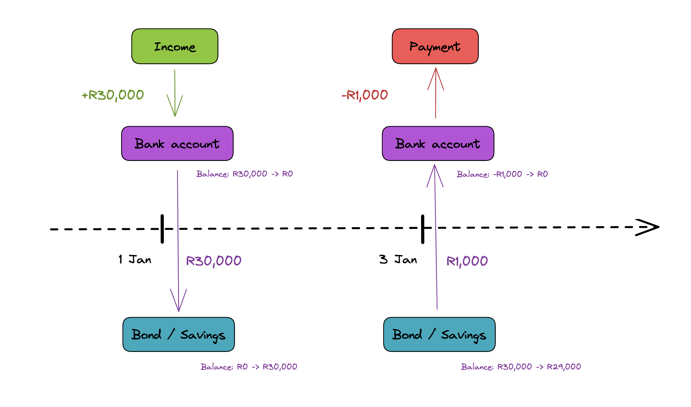

# Investec Money Mover

This repo is responsible for moving money between your transactional Investec account 
and desired Savings/Loan account. The primary goal is keeping the money in your 
transactional account at a minimum and money in your savings/loan account at a maximum.
At the same time, you want to be able to transact freely from your transactional account.

**Please note:**
It is probably a good idea to have some independent mechanism for understand your budgeting 
/ spending amount, as this approach might mask your balances a bit by moving money around.


# How it works
The underlying process is a script that runs every 30 minutes. The script will make sure
that money is sitting in the correct accounts. The logic is as follows:

1. Income goes into your transactional account
2. Script moves that money into your desired savings/loan account
3. You make a payment
4. Script determines whether to move money back into your transactional account 
based on the following parameters
   1. Minimum amount of money you want to keep in your transactional account (MIN_BALANCE)
   2. Available credit facility (FACILITY)




# Prerequisites
1. Make sure that you have programmable banking access enabled with Investec. 
   1. Go to the following [link](https://login.secure.investec.com/wpaas/io-wpaas/programmable-banking/oauth-connected-apps) and add an Oauth app.
   2. This will give you your Client ID, Secret & API Key.
2. Get your desired Transactional Account ID & Savings Account ID


# Deploy
To get this running on a serverless function at an 30 minute interval, simply click the button below.
(You will need to have a GitHub account & Netlify account). The half-hourly process for a full month
should still be well within Netlify's free tier.


[](https://app.netlify.com/start/deploy?repository=https://github.com/nicholasgcoles/investec-money-mover)


# Dev locally
1. Clone the repo
2. `npm install`
3. Once you have that, you need to create a `.env` file in the root of the project, with the following:
```
INVESTEC_CLIENT_ID=XXX
INVESTEC_SECRET=XXX
INVESTEC_API_KEY=XXX
TRANSACTION_ACCOUNT_ID=XXX
SAVINGS_ACCOUNT_ID=XXX
```
